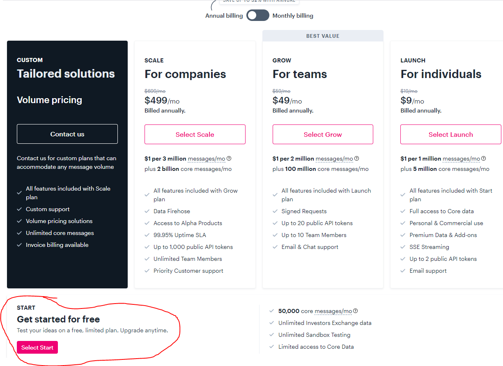
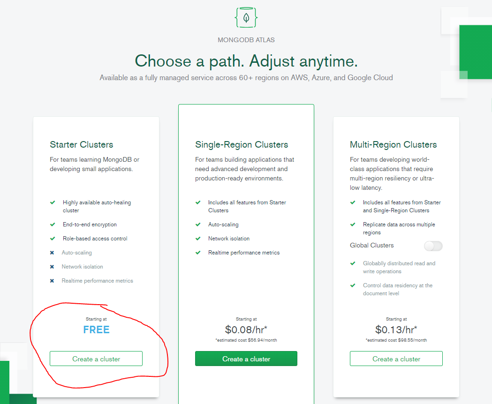
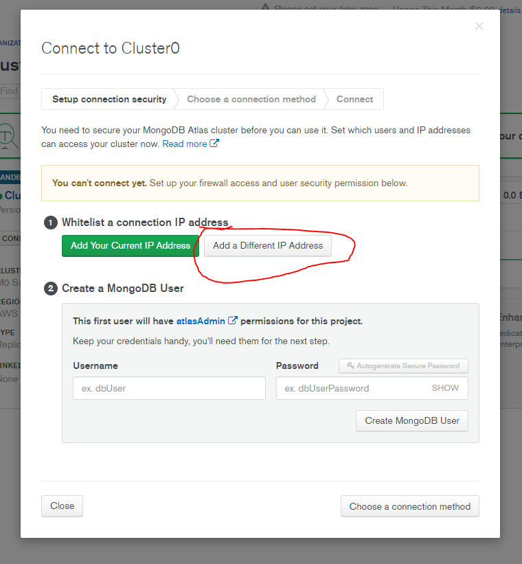
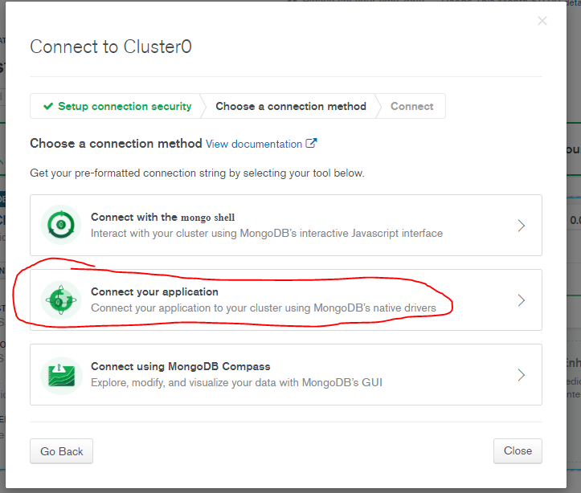

# FINANZAS VOLTA
Implemente un sitio web en el que los usuarios puedan "comprar" y "vender" acciones, como se muestra a continuación.
## INTRODUCCIÓN
Si no está del todo seguro sobre lo que quiere decir comprar y vender acciones, haga click [aquí](http://www.investopedia.com/university/stocks/ )

Está por implementar Finanzas Volta, una aplicaicón web por medio de la cual puede manejar portafolios de acciones. Esta herramienta no sólo le permitirá revisar el precio actual de acciones, también le permitirá comprar ("comprar") y vender ("vender") acciones consultando [IEX](https://iextrading.com/developer/).

De hecho, IEX le permite descargar información de acciones a través de su API (applicacion programming interface) usando URLs como `https://cloud-sse.iexapis.com/stable/stock/nflx/quote?token=API_KEY`. Note que el símbolo de Netflix (NFLX) está embebido en esta URL; esa es la manera en la que IEX sabe qué datos devolver. Este link en particular no devuelve ningún dato porque IEX solicita que usted use una clave API (más sobre esto dentro de poco), pero si lo hiciera, veria una respuesta en formato JSON (JavaScript Object Notation) como esta:
```javascript
{  
   "symbol": "NFLX",
   "companyName": "Netflix, Inc.",
   "primaryExchange": "NASDAQ",
   "calculationPrice": "close",
   "open": 317.49,
   "openTime": 1564752600327,
   "close": 318.83,
   "closeTime": 1564776000616,
   "high": 319.41,
   "low": 311.8,
   "latestPrice": 318.83,
   "latestSource": "Close",
   "latestTime": "August 2, 2019",
   "latestUpdate": 1564776000616,
   "latestVolume": 6232279,
   "iexRealtimePrice": null,
   "iexRealtimeSize": null,
   "iexLastUpdated": null,
   "delayedPrice": 318.83,
   "delayedPriceTime": 1564776000616,
   "extendedPrice": 319.37,
   "extendedChange": 0.54,
   "extendedChangePercent": 0.00169,
   "extendedPriceTime": 1564876784244,
   "previousClose": 319.5,
   "previousVolume": 6563156,
   "change": -0.67,
   "changePercent": -0.0021,
   "volume": 6232279,
   "iexMarketPercent": null,
   "iexVolume": null,
   "avgTotalVolume": 7998833,
   "iexBidPrice": null,
   "iexBidSize": null,
   "iexAskPrice": null,
   "iexAskSize": null,
   "marketCap": 139594933050,
   "peRatio": 120.77,
   "week52High": 386.79,
   "week52Low": 231.23,
   "ytdChange": 0.18907500000000002,
   "lastTradeTime": 1564776000616
}
```
Note que esto es como un objeto de javascript, con parejas de propiedades y valores separadas por comas.
## Código base
### Descargando
ACÁ FALTA PONER MÁS INFORMACIÓN
### Configurando
#### IEX
Antes de comenzar con la tarea, necesitaremos registrarnos para obtener una clave API para poder consultar datos en IEX. Para hacerlo siga estos pasos:
* Visite [iexcloud.io/cloud-login#/register/](iexcloud.io/cloud-login#/register/).
* Ingrese su correo (no use el correo del colegio) y su contraseña, y haga click en "Create account".
* Seleccione el plan gratuito 
* Una vez que haya confirmado su cuenta a través del email de confirmación, vaya a la [página de inicio](iexcloud.io).
* Click API Tokens.
* Copie la clave que aparece, debería comenzar con pk_.
* In a terminal window within CS50 IDE, execute:
ACÁ FALTA ESCRIBIR BIEN ESTE COMANDO *****************************************************************
```bash
export API_KEY=value
```
donde `value` es el valor pegado, sin espacios inmediatamente antes o después del `=`. También debería guardar esta clave en algún archivo de texto, en caso de que la necesite después.

#### MONGODB ATLAS
Para manejar más fácilmente las bases de datos vamos a usar un servicio de DBaaS (DataBase As A Service).
* Vaya a la página de inicio de [mongodb atlas](https://www.mongodb.com/cloud/atlas) y haga click en start free.
* Cree su cuenta, no use el correo del colegio.
* Al iniciar sesión escoja la opción gratuita 
* Deje las opciones que aparecen por defecto y haga click en el botón *create cluster*. Esperar a que se complete la creación del cluster.
* Haga click en connect, luego en `Add a Different IP Address` 
* Luego ingrese la dirección IP `0.0.0.0` y haga click en Add Ip Address
* Seleccione un nombre de usuario y una clave para iniciar sesión en la base de datos y haga click en Create MongoDB User,  luego en Choose a connection method.
* Seleccione Connect your application 
* Copie la cadena generada, y reemplace `<password>` por la contraseña escogida.
* Pegue esta cadena en el archivo keys.js dentro de la carpeta config.
### Corriendo
Inicie la aplicación con el comando `npm run dev`
### Entendiendo

#### `app.js`

EXPLICAR QUÉ HAY EN CADA ARCHIVO

#### `helpers.js`

EXPLICAR QUÉ HAY EN CADA ARCHIVO

#### `requirements.txt`

EXPLICAR QUÉ HAY EN CADA ARCHIVO

#### `static/`

EXPLICAR QUÉ HAY EN CADA ARCHIVO

#### `views/`

EXPLICAR QUÉ HAY EN CADA ARCHIVO

#### `routes/`

EXPLICAR QUÉ HAY EN CADA ARCHIVO

#### `models/`

EXPLICAR QUÉ HAY EN CADA ARCHIVO

## Especificación

### `registrar`
Complete la implementación de `register` de manera que permita al usuario resitrarse a través del formulario.
* Requiera que el usuario ingrese un nombre de usuario, implementado como un campo de texto de `name` `username`. Envié una disculpa si el nombre de usuario es vacío o si el usuario ya existe.
* Requiera que el usuario ingrese una contraseña, implementada como un campo de texto con `name` `password`, y luego la misma contraseña otra vez, implementada como un campo de texto con `name` `confirmation`. Envié una disculpa si alguno de los campos es vacío o si no coinciden.
* 

